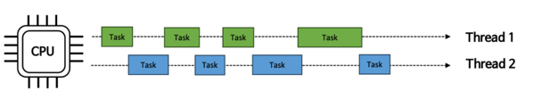
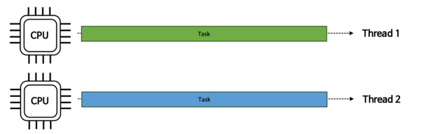
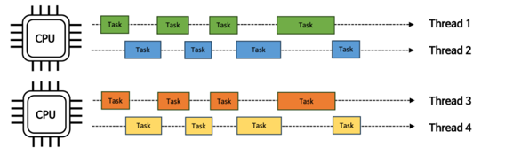
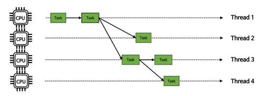

# 동시성, 병행성
## 개요
- 동시성은 <u>특정한 순서 없이 겹치는 기간에 시작, 실행 및 완료되는 여러 작업에</u> 관한 것
- 병렬성은 멀티 코어 프로세서에서 <u>동시에 실행되는 동일한 작업의 여러 작업</u>에 관한 것
- 비슷한 부분은 있지만 동일하지 않다.

## 1. 동시성
- cpu가 <mark>한번에 많은 일을 처리하는 것</mark>에 중점을 둠
  - 많은 작업들을 아주 빠른 시간으로 교체하면서 전체 작업처리
- cpu를 효율적으로 사용하는 것에 더욱 중점을 둠.
  - 스레드가 작업을 처리하다 io 블록에 걸렸을 경우 cpu는 다른 스레드로 전환해서 작업을 진행
- 작업에 대한 처리 방식을 어떤 식으로 진행할 것인가에 대한 관점

## 2. 병렬성
- cpu가 <mark>동시에 많은 일을 수행하는 것</mark>에 중점을 둔다.
  - 한 개의 코어에서는 병렬성이 구현될 수 없다.
- 동시성에 하위 개념으로 작업을 여러 스레드로 분리하고, 운영체제는 그 스레드를 여러 cpu에 적절히 분배하여 동시적으로 실행되도록 함
- 하드웨어 계층에서의 작업 수행 방식을 의미
- 작업해야 할 수가 cpu 코어 수보다 같거나 적을경우 가장 효율성이 좋다.

## 3. 병렬성과 동시성 조합
### ThreadPoolExecutor
- 병렬성으로 처리 성능을 극대화하고 동시성으로 cpu 자원을 효율적으로 운용.

### ForkJoinPool
- 하나의 태스크를 서브 태스크로 분할하여 병렬처리함으로써 전체 작업 성능을 높인다.
